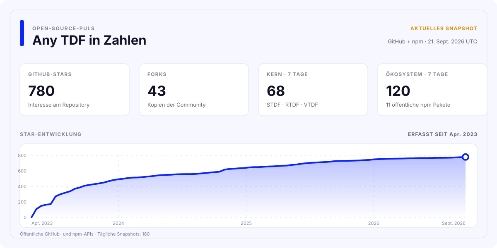

<div align="center">

[](https://github.com/any-tdf/any-tdf/actions/workflows/ci.yml)
[](https://github.com/any-tdf/any-tdf/actions/workflows/publish-npm.yml)
[](https://github.com/any-tdf/any-tdf/actions/workflows/publish-vscode.yml)
[](https://github.com/any-tdf/any-tdf/actions/workflows/release.yml)

<picture>
  <source media="(prefers-color-scheme: dark)" srcset="../.github/assets/any-tdf-logo-dark.svg" />
  <source media="(prefers-color-scheme: light)" srcset="../.github/assets/any-tdf-logo-light.svg" />
  
</picture>

# Any TDF

Ein gemeinsames Designsystem. Drei frameworknative mobile Komponentenbibliotheken.

**STDF für Svelte • RTDF für React • VTDF für Vue**


<p>
  <a href="https://www.npmjs.com/package/stdf"></a>
  <a href="https://www.npmjs.com/package/rtdf"></a>
  <a href="https://www.npmjs.com/package/vtdf"></a>
</p>

<p>
  <a href="https://www.npmjs.com/package/@any-tdf/common"></a>
  <a href="https://www.npmjs.com/package/create-any-tdf"></a>
  <a href="https://www.npmjs.com/package/@any-tdf/vite-plugin-svg-symbol"></a>
  <a href="https://www.npmjs.com/package/@any-tdf/vite-plugin-md-ts"></a>
</p>

<p>
  <a href="https://www.npmjs.com/package/@any-tdf/react-motion"></a>
  <a href="https://www.npmjs.com/package/@any-tdf/vue-motion"></a>
  <a href="https://www.npmjs.com/package/@any-tdf/react-confetti"></a>
  <a href="https://www.npmjs.com/package/@any-tdf/vue-confetti"></a>
</p>

[](../extensions/vscode-extension)
[](https://github.com/any-tdf/any-tdf)
[](https://github.com/any-tdf/any-tdf/blob/main/LICENSE)

[STDF](https://stdf.dev) • [RTDF](https://rtdf.dev) • [VTDF](https://vtdf.dev)

[English](../README.md) • [简体中文](./README_zh_CN.md) • [繁體中文](./README_zh_TW.md) • [日本語](./README_ja_JP.md) • [한국어](./README_ko_KR.md) • [Español](./README_es_ES.md) • [Русский](./README_ru_RU.md) • [Français](./README_fr_FR.md) • [Deutsch](./README_de_DE.md) • [Italiano](./README_it_IT.md)

</div>

## Einführung

Any TDF ist ein Mobile-First-Komponentensystem für Svelte, React und Vue. Die drei Bibliotheken teilen Produktverhalten, visuelle Sprache, Themes, Sprachdaten, öffentliche Typen, Dokumentationsstruktur und Regeln zur Barrierefreiheit, bewahren jedoch das Renderingmodell und die Kompositionsmuster des jeweiligen Frameworks.

Es ist weder ein Cross-Framework-Wrapper noch eine einzelne, hinter Adaptern verborgene Runtime. STDF stellt Svelte-Komponenten, Snippets, Actions und Transitions bereit; RTDF bietet React-Komponenten, Props, Renderfunktionen, Hooks und Provider; VTDF liefert Vue-Komponenten, Slots, Events und Composables.

## Produktfamilie

| Bibliothek | Natives Framework | npm-Paket                                    | Dokumentation und Demo       |
| ---------- | ----------------- | -------------------------------------------- | ---------------------------- |
| STDF       | Svelte            | [`stdf`](https://www.npmjs.com/package/stdf) | [stdf.dev](https://stdf.dev) |
| RTDF       | React             | [`rtdf`](https://www.npmjs.com/package/rtdf) | [rtdf.dev](https://rtdf.dev) |
| VTDF       | Vue               | [`vtdf`](https://www.npmjs.com/package/vtdf) | [vtdf.dev](https://vtdf.dev) |

## Warum Any TDF

- 60 abgestimmte mobile Komponenten mit frameworknativen APIs und vorhersehbarem Verhalten.
- Ein gemeinsames Tailwind-CSS-Themesystem mit Dark Mode, Laufzeitwechsel, eigenen Themes und wiederverwendbaren semantischen Farben.
- Mehr als 60 integrierte Sprachpakete sowie chinesische und englische Anleitungen, API-Referenzen und Komponentenbeispiele.
- TypeScript-zentrierte Paketexporte, SSR, bedarfsgesteuerte Imports und gemeinsames Barrierefreiheitsverhalten.
- Native Svelte-Motion-Semantik mit entsprechenden Motion-Paketen für React und Vue.
- Einheitlicher Projektgenerator, SVG-Sprite- und Markdown-Plugins, Offline-AI-Skills und VS-Code-Erweiterung.
- Vertrags-, Paket-, Routen-, Browser- und visuelle Prüfungen halten die drei Implementierungen synchron.

## Schnellstart

> Die neue Komponentengeneration wird derzeit auf npm unter dem Tag `alpha` veröffentlicht. Die beiden Vite-Plugins verwenden den stabilen Tag `latest`.

Erstelle interaktiv ein TypeScript-Projekt:

```sh
bun create any-tdf@alpha
```

Framework und Vorlage können auch direkt angegeben werden:

```sh
bun create any-tdf@alpha my-app -f svelte -t sktt -b lucide
bun create any-tdf@alpha my-app -f react -t vrtt -b phosphor
bun create any-tdf@alpha my-app -f vue -t vrtt -b tabler
```

Der Generator bietet Vite- und SvelteKit-Vorlagen, TypeScript, Tailwind CSS oder UnoCSS, mehrere Icon-Strategien, integrierte Icon-Bibliotheken sowie Konfigurationen für einzelne oder mehrere Themes. Alle Optionen stehen in der [`create-any-tdf`-Referenz](../packages/create-any-tdf/README.md).

So fügst du eine Komponentenbibliothek zu einer bestehenden Anwendung hinzu:

```sh
bun add stdf@alpha svelte tailwindcss
bun add rtdf@alpha react react-dom tailwindcss
bun add vtdf@alpha vue tailwindcss
```

Installiere nur die Zeile für dein Framework. Jedes Paket installiert seine gemeinsamen Any-TDF-Runtime-Abhängigkeiten automatisch. Stylesheet-Imports, Theme-Konfiguration, Komponenten und Migrationsanleitungen findest du auf der jeweiligen Website.

## Paket-Ökosystem

Alle öffentlichen npm-Pakete dieses Monorepos sind nachfolgend aufgeführt. Die Badges am Anfang der README zeigen die veröffentlichte Version jedes Pakets.

| Bereich          | Paket                                                                                              | Zweck                                                                             | Dokumentation                                          |
| ---------------- | -------------------------------------------------------------------------------------------------- | --------------------------------------------------------------------------------- | ------------------------------------------------------ |
| Gemeinsame Basis | [`@any-tdf/common`](https://www.npmjs.com/package/@any-tdf/common)                                 | Frameworkunabhängiger Zustand, Themes, Sprachen, SVG-Daten und Typen.             | [README](../packages/common/README.md)                 |
| Komponenten      | [`stdf`](https://www.npmjs.com/package/stdf)                                                       | Svelte-Implementierung des Any-TDF-Komponentensystems.                            | [stdf.dev](https://stdf.dev)                           |
| Komponenten      | [`rtdf`](https://www.npmjs.com/package/rtdf)                                                       | React-Implementierung des Any-TDF-Komponentensystems.                             | [rtdf.dev](https://rtdf.dev)                           |
| Komponenten      | [`vtdf`](https://www.npmjs.com/package/vtdf)                                                       | Vue-Implementierung des Any-TDF-Komponentensystems.                               | [vtdf.dev](https://vtdf.dev)                           |
| Scaffolding      | [`create-any-tdf`](https://www.npmjs.com/package/create-any-tdf)                                   | Frameworknative TypeScript-Vorlagen und Einrichtungsoptionen.                     | [README](../packages/create-any-tdf/README.md)         |
| Build-Werkzeuge  | [`@any-tdf/vite-plugin-svg-symbol`](https://www.npmjs.com/package/@any-tdf/vite-plugin-svg-symbol) | Kombiniert SVG-Ordner zu wiederverwendbaren Symbolen für Vite und Rollup.         | [README](../packages/vite-plugin-svg-symbol/README.md) |
| Build-Werkzeuge  | [`@any-tdf/vite-plugin-md-ts`](https://www.npmjs.com/package/@any-tdf/vite-plugin-md-ts)           | Importiert Markdown als Quelltext oder generiertes HTML in Vite und Rollup.       | [README](../packages/vite-plugin-md-ts/README.md)      |
| Motion           | [`@any-tdf/react-motion`](https://www.npmjs.com/package/@any-tdf/react-motion)                     | An Svelte angelehnte Easing-, Transition-, Animations- und Motion-APIs für React. | [Demo](https://react-motion.any-tdf.dev)               |
| Motion           | [`@any-tdf/vue-motion`](https://www.npmjs.com/package/@any-tdf/vue-motion)                         | An Svelte angelehnte Easing-, Transition-, Animations- und Motion-APIs für Vue.   | [Demo](https://vue-motion.any-tdf.dev)                 |
| Confetti         | [`@any-tdf/react-confetti`](https://www.npmjs.com/package/@any-tdf/react-confetti)                 | SSR-freundlicher React-Confetti-Effekt aus reinem HTML und CSS.                   | [Demo](https://react-confetti.any-tdf.dev)             |
| Confetti         | [`@any-tdf/vue-confetti`](https://www.npmjs.com/package/@any-tdf/vue-confetti)                     | SSR-freundlicher Vue-Confetti-Effekt aus reinem HTML und CSS.                     | [Demo](https://vue-confetti.any-tdf.dev)               |

## Gemeinsame Architektur, natives Rendering

Die gemeinsame Schicht hat bewusst einen engen Verantwortungsbereich. `@any-tdf/common` verwaltet wiederverwendbare Zustandsableitung, Themes, Sprach- und SVG-Daten, Typen sowie kleine Plattformhilfen. STDF, RTDF und VTDF verwenden diese Verträge, rendern aber mit den Primitiven ihres jeweiligen Frameworks.

Diese Trennung bietet:

- Vertraute Komponentensyntax, Events, Slots, Children und Kompositionsmuster in jedem Framework.
- Einheitliche Komponentenfunktionen, Benennung, Themes, Sprachverhalten und mobile Interaktionen.
- Unabhängige npm-Pakete, Dokumentationsseiten, Demos, Versionshinweise und Framework-Aktualisierungen.
- Keinen Cross-Framework-Renderer und keine zusätzliche Kompatibilitäts-Runtime im Anwendungscode.

## VS-Code-Erweiterung

[Any TDF for VS Code](../extensions/vscode-extension/README.md) bietet Hover-Dokumentation und Komponenten-API-Vervollständigung für STDF, RTDF und VTDF. Sie erkennt die nächste `package.json`, aktiviert nur die passende Bibliothek, versteht Svelte-, JSX-, TSX- und Vue-Dateien und zeigt chinesische oder englische API-Dokumentation an.

Quellcode, Paketierungs- und Veröffentlichungsprüfungen der Erweiterung werden in diesem Monorepo gepflegt. So erstellst du eine lokale VSIX:

```sh
bun run --filter stdf-vscode-extension package
```

## Offline-AI-Skills

Frameworkspezifische Skills bündeln Komponentenreferenzen, Themes, Internationalisierung, Scaffolding, Icon-Strategien und Skripte zur Theme-Generierung für KI-Coding-Agenten. Sie werden im Quellrepository gepflegt und bewusst nicht auf npm veröffentlicht.

- [`stdf-skill`](../packages/skills/stdf-skill/README.md)
- [`rtdf-skill`](../packages/skills/rtdf-skill/README.md)
- [`vtdf-skill`](../packages/skills/vtdf-skill/README.md)

## Monorepo-Entwicklung

Das Repository verwendet Bun Workspaces, Turborepo, Changesets und eine einzige Lockdatei im Stammverzeichnis. Für die Entwicklung werden Bun und Node.js verwendet. Installiere Abhängigkeiten nur vom Repository-Stammverzeichnis aus.

```sh
bun install --frozen-lockfile
bun run check
bun run test
bun run build
bun run verify
```

Starte das Any-TDF-Portal oder Website und Demo eines Frameworks gemeinsam:

```sh
bun run dev:any-tdf
bun run dev:stdf
bun run dev:rtdf
bun run dev:vtdf
```

Häufig verwendete repositoryweite Befehle:

| Befehl                   | Zweck                                                                       |
| ------------------------ | --------------------------------------------------------------------------- |
| `bun run generate`       | Generiert Framework-, Dokumentations-, Versions- und Erweiterungsdaten neu. |
| `bun run generate:check` | Prüft, ob generierte Dateien ihren Quellen entsprechen.                     |
| `bun run quality:check`  | Baut das Monorepo und prüft Formatierung und Lint.                          |
| `bun run verify:browser` | Prüft Demo- und Dokumentationsinteraktionen in einem echten Browser.        |
| `bun run changeset`      | Beschreibt Paketänderungen für die nächste Veröffentlichung.                |

## Repository-Struktur

- `apps`: Dokumentationsseiten, Komponenten-Demos und gemeinsamer Site-Code.
- `packages`: gemeinsamer Kern, Frameworkbibliotheken, Vite-Plugins, Motion- und Confetti-Runtimes mit paketlokaler Dokumentation, AI Skills und `create-any-tdf`.
- `content`: generierte STDF-, RTDF- und VTDF-Komponenten und Anleitungen.
- `extensions`: die Any-TDF-Erweiterung für VS Code.
- `scripts`: repositoryweite Werkzeuge für Generierung, Prüfung, Paketierung und Veröffentlichung.

## Beiträge und Feedback

Nutze [GitHub Issues](https://github.com/any-tdf/any-tdf/issues) für reproduzierbare Fehler und Funktionswünsche sowie [GitHub Discussions](https://github.com/any-tdf/any-tdf/discussions) für Fragen, Vorschläge und Implementierungsideen. Beiträge zu Komponenten, Dokumentation, Werkzeugen, Tests, Beispielen und Übersetzungen sind willkommen.

Die vollständige Liste findest du im [Mitwirkenden-Diagramm](https://github.com/any-tdf/any-tdf/graphs/contributors).

## Sponsoren

Vielen Dank an [sbscan](https://github.com/sbscan), [MuGuiLin](https://github.com/MuGuiLin) und [yuedanlabs](https://github.com/yuedanlabs) für die Unterstützung.

## Lizenz

Any TDF wird unter der [MIT-Lizenz](https://github.com/any-tdf/any-tdf/blob/main/LICENSE) veröffentlicht.

## Projektstatistiken

<a href="https://any-tdf.dev/#statistics">
  <picture>
    <source media="(prefers-color-scheme: dark)" srcset="../.github/assets/project-stats-de_DE-dark.svg" />
    
  </picture>
</a>

Die Daten werden wöchentlich über die öffentlichen GitHub- und npm-APIs aktualisiert. Der Trendverlauf wird ab dem ersten Any TDF Snapshot aufgebaut.
