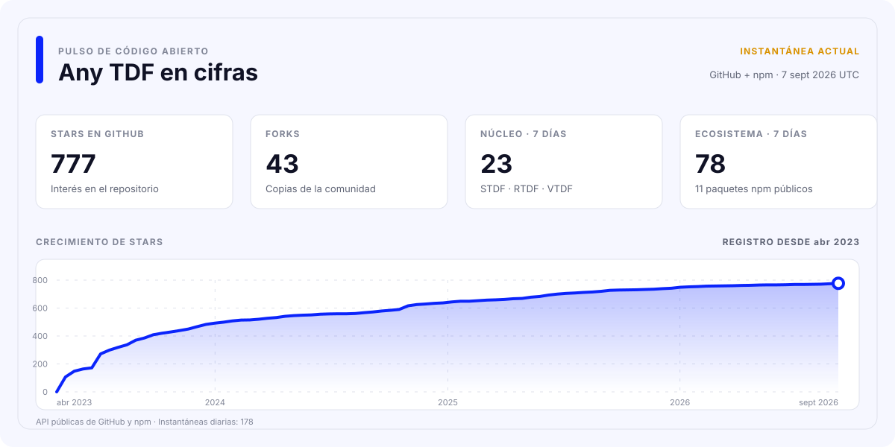

<div align="center">

[](https://github.com/any-tdf/any-tdf/actions/workflows/ci.yml)
[](https://github.com/any-tdf/any-tdf/actions/workflows/publish-npm.yml)
[](https://github.com/any-tdf/any-tdf/actions/workflows/publish-vscode.yml)
[](https://github.com/any-tdf/any-tdf/actions/workflows/release.yml)

<picture>
  <source media="(prefers-color-scheme: dark)" srcset="../.github/assets/any-tdf-logo-dark.svg" />
  <source media="(prefers-color-scheme: light)" srcset="../.github/assets/any-tdf-logo-light.svg" />
  
</picture>

# Any TDF

Un sistema de diseño compartido. Tres bibliotecas de componentes móviles nativas para cada framework.

**STDF para Svelte • RTDF para React • VTDF para Vue**


<p>
  <a href="https://www.npmjs.com/package/stdf"></a>
  <a href="https://www.npmjs.com/package/rtdf"></a>
  <a href="https://www.npmjs.com/package/vtdf"></a>
</p>

<p>
  <a href="https://www.npmjs.com/package/@any-tdf/common"></a>
  <a href="https://www.npmjs.com/package/create-any-tdf"></a>
  <a href="https://www.npmjs.com/package/@any-tdf/vite-plugin-svg-symbol"></a>
  <a href="https://www.npmjs.com/package/@any-tdf/vite-plugin-md-ts"></a>
</p>

<p>
  <a href="https://www.npmjs.com/package/@any-tdf/react-motion"></a>
  <a href="https://www.npmjs.com/package/@any-tdf/vue-motion"></a>
  <a href="https://www.npmjs.com/package/@any-tdf/react-confetti"></a>
  <a href="https://www.npmjs.com/package/@any-tdf/vue-confetti"></a>
</p>

[](../extensions/vscode-extension)
[](https://github.com/any-tdf/any-tdf)
[](https://github.com/any-tdf/any-tdf/blob/main/LICENSE)

[STDF](https://stdf.dev) • [RTDF](https://rtdf.dev) • [VTDF](https://vtdf.dev) • [Issues](https://github.com/any-tdf/any-tdf/issues) • [Discussions](https://github.com/any-tdf/any-tdf/discussions)

[English](../README.md) • [简体中文](./README_zh_CN.md) • [繁體中文](./README_zh_TW.md) • [日本語](./README_ja_JP.md) • [한국어](./README_ko_KR.md) • [Español](./README_es_ES.md) • [Русский](./README_ru_RU.md) • [Français](./README_fr_FR.md) • [Deutsch](./README_de_DE.md) • [Italiano](./README_it_IT.md)

</div>

## Introducción

Any TDF es un sistema de componentes orientado a dispositivos móviles para Svelte, React y Vue. Sus tres bibliotecas comparten comportamiento de producto, lenguaje visual, temas, datos de idioma, tipos públicos, estructura de documentación y reglas de accesibilidad, a la vez que conservan el modelo de renderizado y la composición propios de cada framework.

No es un wrapper entre frameworks ni un único runtime oculto tras adaptadores. STDF expone componentes, snippets, acciones y transiciones de Svelte; RTDF ofrece componentes, props, funciones de renderizado, hooks y providers de React; VTDF proporciona componentes, slots, eventos y composables de Vue.

## Familia de productos

| Biblioteca | Framework nativo | Paquete npm                                  | Documentación y Demo         |
| ---------- | ---------------- | -------------------------------------------- | ---------------------------- |
| STDF       | Svelte           | [`stdf`](https://www.npmjs.com/package/stdf) | [stdf.dev](https://stdf.dev) |
| RTDF       | React            | [`rtdf`](https://www.npmjs.com/package/rtdf) | [rtdf.dev](https://rtdf.dev) |
| VTDF       | Vue              | [`vtdf`](https://www.npmjs.com/package/vtdf) | [vtdf.dev](https://vtdf.dev) |

## Por qué elegir Any TDF

- 60 componentes móviles alineados, con API nativas de cada framework y un comportamiento predecible.
- Un sistema de temas Tailwind CSS compartido con modo oscuro, cambio en ejecución, temas personalizados y colores semánticos reutilizables.
- Más de 60 paquetes de idioma integrados, además de guías, referencias de API y ejemplos de componentes en chino e inglés.
- Exportaciones de paquetes centradas en TypeScript, SSR, importaciones bajo demanda y accesibilidad compartida.
- Semántica de movimiento nativa de Svelte con paquetes equivalentes para React y Vue.
- Generador de proyectos unificado, plugins de SVG Sprite y Markdown, AI Skills sin conexión y extensión de VS Code.
- Comprobaciones de contratos, paquetes, rutas, navegador y aspecto visual para mantener alineadas las tres implementaciones.

## Inicio rápido

> La nueva generación de componentes se publica actualmente en npm con la etiqueta `alpha`. Los dos plugins de Vite utilizan la etiqueta estable `latest`.

Crea un proyecto TypeScript de forma interactiva:

```sh
bun create any-tdf@alpha
```

También puedes indicar directamente el framework y la plantilla:

```sh
bun create any-tdf@alpha my-app -f svelte -t sktt -b lucide
bun create any-tdf@alpha my-app -f react -t vrtt -b phosphor
bun create any-tdf@alpha my-app -f vue -t vrtt -b tabler
```

El generador ofrece plantillas Vite y SvelteKit, TypeScript, Tailwind CSS o UnoCSS, varias estrategias de iconos, bibliotecas de iconos integradas y configuraciones de uno o varios temas. Consulta todas las opciones en la [referencia de `create-any-tdf`](../packages/create-any-tdf/README.md).

Para añadir una biblioteca de componentes a una aplicación existente:

```sh
bun add stdf@alpha svelte tailwindcss
bun add rtdf@alpha react react-dom tailwindcss
bun add vtdf@alpha vue tailwindcss
```

Instala solo la línea correspondiente a tu framework. Cada paquete instala automáticamente sus dependencias compartidas de Any TDF. Consulta el sitio correspondiente para importar estilos, configurar temas, utilizar componentes y revisar las guías de migración.

## Ecosistema de paquetes

A continuación se enumeran todos los paquetes npm públicos mantenidos en este Monorepo. Las insignias de la parte superior muestran la versión publicada de cada paquete.

| Área            | Paquete                                                                                            | Finalidad                                                                     | Documentación                                          |
| --------------- | -------------------------------------------------------------------------------------------------- | ----------------------------------------------------------------------------- | ------------------------------------------------------ |
| Base compartida | [`@any-tdf/common`](https://www.npmjs.com/package/@any-tdf/common)                                 | Estado, temas, idiomas, datos SVG y tipos independientes del framework.       | [README](../packages/common/README.md)                 |
| Componentes     | [`stdf`](https://www.npmjs.com/package/stdf)                                                       | Implementación Svelte del sistema de componentes Any TDF.                     | [stdf.dev](https://stdf.dev)                           |
| Componentes     | [`rtdf`](https://www.npmjs.com/package/rtdf)                                                       | Implementación React del sistema de componentes Any TDF.                      | [rtdf.dev](https://rtdf.dev)                           |
| Componentes     | [`vtdf`](https://www.npmjs.com/package/vtdf)                                                       | Implementación Vue del sistema de componentes Any TDF.                        | [vtdf.dev](https://vtdf.dev)                           |
| Scaffolding     | [`create-any-tdf`](https://www.npmjs.com/package/create-any-tdf)                                   | Plantillas TypeScript nativas para cada framework y opciones de instalación.  | [README](../packages/create-any-tdf/README.md)         |
| Herramientas    | [`@any-tdf/vite-plugin-svg-symbol`](https://www.npmjs.com/package/@any-tdf/vite-plugin-svg-symbol) | Combina carpetas SVG en símbolos reutilizables para Vite y Rollup.            | [README](../packages/vite-plugin-svg-symbol/README.md) |
| Herramientas    | [`@any-tdf/vite-plugin-md-ts`](https://www.npmjs.com/package/@any-tdf/vite-plugin-md-ts)           | Importa Markdown como texto original o HTML generado en Vite y Rollup.        | [README](../packages/vite-plugin-md-ts/README.md)      |
| Movimiento      | [`@any-tdf/react-motion`](https://www.npmjs.com/package/@any-tdf/react-motion)                     | Easing, transiciones, animación y movimiento compatibles con Svelte en React. | [Demo](https://react-motion.any-tdf.dev)               |
| Movimiento      | [`@any-tdf/vue-motion`](https://www.npmjs.com/package/@any-tdf/vue-motion)                         | Easing, transiciones, animación y movimiento compatibles con Svelte en Vue.   | [Demo](https://vue-motion.any-tdf.dev)                 |
| Confetti        | [`@any-tdf/react-confetti`](https://www.npmjs.com/package/@any-tdf/react-confetti)                 | Efecto Confetti en HTML y CSS puro para React, compatible con SSR.            | [Demo](https://react-confetti.any-tdf.dev)             |
| Confetti        | [`@any-tdf/vue-confetti`](https://www.npmjs.com/package/@any-tdf/vue-confetti)                     | Efecto Confetti en HTML y CSS puro para Vue, compatible con SSR.              | [Demo](https://vue-confetti.any-tdf.dev)               |

## Arquitectura compartida, renderizado nativo

La capa compartida tiene una responsabilidad deliberadamente limitada. `@any-tdf/common` contiene la derivación de estado reutilizable, los temas, los datos de idioma y SVG, los tipos y pequeñas utilidades de plataforma. STDF, RTDF y VTDF consumen esos contratos, pero renderizan con las primitivas de su propio framework.

Esta separación ofrece:

- Sintaxis de componentes, eventos, slots, children y composición familiares en cada framework.
- Capacidades, nombres, temas, idiomas e interacciones móviles coherentes.
- Paquetes npm, sitios de documentación, Demos, notas de versión y actualizaciones de framework independientes.
- Ningún renderizador entre frameworks ni runtime de compatibilidad adicional en el código de la aplicación.

## Extensión de VS Code

[Any TDF for VS Code](../extensions/vscode-extension/README.md) ofrece documentación al pasar el cursor y autocompletado de API para STDF, RTDF y VTDF. Detecta el `package.json` más cercano, activa únicamente la biblioteca correspondiente, comprende archivos Svelte, JSX, TSX y Vue, y muestra documentación de API en chino o inglés.

El código de la extensión y sus comprobaciones de empaquetado y publicación se mantienen en este Monorepo. Para crear un VSIX local:

```sh
bun run --filter stdf-vscode-extension package
```

## AI Skills sin conexión

Los Skills específicos de cada framework reúnen referencias de componentes, temas, internacionalización, scaffolding, estrategias de iconos y scripts para generar temas destinados a agentes de programación con IA. Se mantienen en el repositorio de código y no se publican deliberadamente en npm.

- [`stdf-skill`](../packages/skills/stdf-skill/README.md)
- [`rtdf-skill`](../packages/skills/rtdf-skill/README.md)
- [`vtdf-skill`](../packages/skills/vtdf-skill/README.md)

## Desarrollo del Monorepo

El repositorio utiliza Bun Workspaces, Turborepo, Changesets y un único archivo de bloqueo raíz. El desarrollo utiliza Bun y Node.js. Instala las dependencias únicamente desde la raíz del repositorio.

```sh
bun install --frozen-lockfile
bun run check
bun run test
bun run build
bun run verify
```

Ejecuta el portal Any TDF o, conjuntamente, el sitio y la Demo de un framework:

```sh
bun run dev:any-tdf
bun run dev:stdf
bun run dev:rtdf
bun run dev:vtdf
```

Comandos habituales para todo el repositorio:

| Comando                  | Finalidad                                                               |
| ------------------------ | ----------------------------------------------------------------------- |
| `bun run generate`       | Regenera los datos de frameworks, documentación, versiones y extensión. |
| `bun run generate:check` | Confirma que los archivos generados coinciden con sus fuentes.          |
| `bun run quality:check`  | Compila el Monorepo y comprueba el formato y el lint.                   |
| `bun run verify:browser` | Verifica interacciones de Demos y documentación en un navegador real.   |
| `bun run changeset`      | Describe los cambios de paquetes para la próxima publicación.           |

## Estructura del repositorio

- `apps`: sitios de documentación, Demos de componentes y código compartido de sitios.
- `packages`: núcleo común, bibliotecas de framework, plugins de Vite, runtimes Motion y Confetti con documentación por paquete, AI Skills y `create-any-tdf`.
- `content`: componentes y guías generados para STDF, RTDF y VTDF.
- `extensions`: la extensión Any TDF para VS Code.
- `scripts`: herramientas globales de generación, validación, empaquetado y publicación.

## Contribuciones y comentarios

Utiliza [GitHub Issues](https://github.com/any-tdf/any-tdf/issues) para errores reproducibles y propuestas, y [GitHub Discussions](https://github.com/any-tdf/any-tdf/discussions) para preguntas, diseños e ideas de implementación. Agradecemos contribuciones a componentes, documentación, herramientas, pruebas, ejemplos y traducciones.

Consulta el [gráfico completo de colaboradores](https://github.com/any-tdf/any-tdf/graphs/contributors).

## Patrocinadores

Gracias a [sbscan](https://github.com/sbscan), [MuGuiLin](https://github.com/MuGuiLin) y [yuedanlabs](https://github.com/yuedanlabs) por apoyar el proyecto.

## Licencia

Any TDF se publica bajo la [Licencia MIT](https://github.com/any-tdf/any-tdf/blob/main/LICENSE).

## Estadísticas del proyecto

<a href="https://any-tdf.dev/#statistics">
  <picture>
    <source media="(prefers-color-scheme: dark)" srcset="../.github/assets/project-stats-es_ES-dark.svg" />
    
  </picture>
</a>

Los datos se actualizan semanalmente desde las API públicas de GitHub y npm. El historial de tendencias se acumula desde la primera instantánea de Any TDF.
