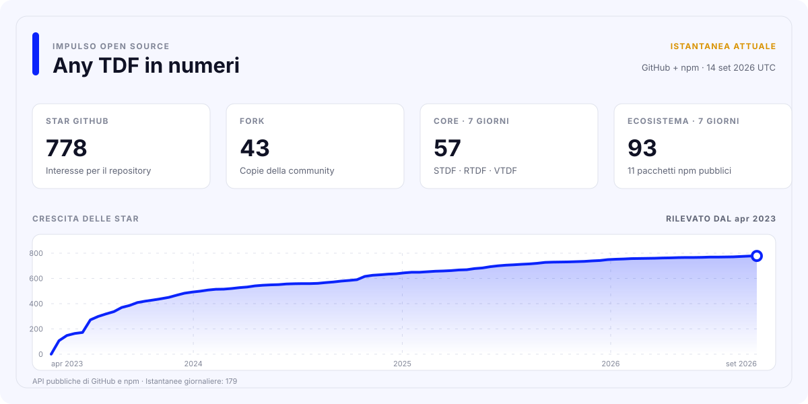

<div align="center">

[](https://github.com/any-tdf/any-tdf/actions/workflows/ci.yml)
[](https://github.com/any-tdf/any-tdf/actions/workflows/publish-npm.yml)
[](https://github.com/any-tdf/any-tdf/actions/workflows/publish-vscode.yml)
[](https://github.com/any-tdf/any-tdf/actions/workflows/release.yml)

<picture>
  <source media="(prefers-color-scheme: dark)" srcset="../.github/assets/any-tdf-logo-dark.svg" />
  <source media="(prefers-color-scheme: light)" srcset="../.github/assets/any-tdf-logo-light.svg" />
  
</picture>

# Any TDF

Un design system condiviso. Tre librerie di componenti mobile native per ogni framework.

**STDF per Svelte • RTDF per React • VTDF per Vue**


<p>
  <a href="https://www.npmjs.com/package/stdf"></a>
  <a href="https://www.npmjs.com/package/rtdf"></a>
  <a href="https://www.npmjs.com/package/vtdf"></a>
</p>

<p>
  <a href="https://www.npmjs.com/package/@any-tdf/common"></a>
  <a href="https://www.npmjs.com/package/create-any-tdf"></a>
  <a href="https://www.npmjs.com/package/@any-tdf/vite-plugin-svg-symbol"></a>
  <a href="https://www.npmjs.com/package/@any-tdf/vite-plugin-md-ts"></a>
</p>

<p>
  <a href="https://www.npmjs.com/package/@any-tdf/react-motion"></a>
  <a href="https://www.npmjs.com/package/@any-tdf/vue-motion"></a>
  <a href="https://www.npmjs.com/package/@any-tdf/react-confetti"></a>
  <a href="https://www.npmjs.com/package/@any-tdf/vue-confetti"></a>
</p>

[](../extensions/vscode-extension)
[](https://github.com/any-tdf/any-tdf)
[](https://github.com/any-tdf/any-tdf/blob/main/LICENSE)

[STDF](https://stdf.dev) • [RTDF](https://rtdf.dev) • [VTDF](https://vtdf.dev) • [Issues](https://github.com/any-tdf/any-tdf/issues) • [Discussions](https://github.com/any-tdf/any-tdf/discussions)

[English](../README.md) • [简体中文](./README_zh_CN.md) • [繁體中文](./README_zh_TW.md) • [日本語](./README_ja_JP.md) • [한국어](./README_ko_KR.md) • [Español](./README_es_ES.md) • [Русский](./README_ru_RU.md) • [Français](./README_fr_FR.md) • [Deutsch](./README_de_DE.md) • [Italiano](./README_it_IT.md)

</div>

## Introduzione

Any TDF è un sistema di componenti mobile-first per Svelte, React e Vue. Le tre librerie condividono comportamento di prodotto, linguaggio visivo, temi, dati di lingua, tipi pubblici, struttura della documentazione e regole di accessibilità, mantenendo il modello di rendering e le modalità di composizione native di ogni framework.

Non è un wrapper tra framework né un singolo runtime nascosto dietro adattatori. STDF espone componenti, snippet, action e transition Svelte; RTDF offre componenti, props, funzioni di rendering, hook e provider React; VTDF fornisce componenti, slot, eventi e composable Vue.

## Famiglia di prodotti

| Libreria | Framework nativo | Pacchetto npm                                | Documentazione e Demo        |
| -------- | ---------------- | -------------------------------------------- | ---------------------------- |
| STDF     | Svelte           | [`stdf`](https://www.npmjs.com/package/stdf) | [stdf.dev](https://stdf.dev) |
| RTDF     | React            | [`rtdf`](https://www.npmjs.com/package/rtdf) | [rtdf.dev](https://rtdf.dev) |
| VTDF     | Vue              | [`vtdf`](https://www.npmjs.com/package/vtdf) | [vtdf.dev](https://vtdf.dev) |

## Perché scegliere Any TDF

- 60 componenti mobili allineati, con API native per ciascun framework e comportamento prevedibile.
- Un sistema di temi Tailwind CSS condiviso con modalità scura, cambio a runtime, temi personalizzati e colori semantici riutilizzabili.
- Oltre 60 pacchetti di lingua integrati, con guide, riferimenti API ed esempi di componenti in cinese e inglese.
- Esportazioni dei pacchetti orientate a TypeScript, SSR, import su richiesta e accessibilità condivisa.
- Semantica di movimento nativa di Svelte con pacchetti equivalenti per React e Vue.
- Generatore di progetti unificato, plugin SVG Sprite e Markdown, AI Skills offline ed estensione VS Code.
- Controlli di contratti, pacchetti, route, browser e aspetto visivo per mantenere allineate le tre implementazioni.

## Avvio rapido

> La nuova generazione di componenti è attualmente pubblicata su npm con il tag `alpha`. I due plugin Vite usano il tag stabile `latest`.

Crea un progetto TypeScript in modo interattivo:

```sh
bun create any-tdf@alpha
```

Puoi anche specificare direttamente framework e template:

```sh
bun create any-tdf@alpha my-app -f svelte -t sktt -b lucide
bun create any-tdf@alpha my-app -f react -t vrtt -b phosphor
bun create any-tdf@alpha my-app -f vue -t vrtt -b tabler
```

Il generatore offre template Vite e SvelteKit, TypeScript, Tailwind CSS o UnoCSS, diverse strategie per le icone, librerie di icone integrate e configurazioni con tema singolo o multiplo. Consulta tutte le opzioni nel [riferimento di `create-any-tdf`](../packages/create-any-tdf/README.md).

Per aggiungere una libreria di componenti a un’applicazione esistente:

```sh
bun add stdf@alpha svelte tailwindcss
bun add rtdf@alpha react react-dom tailwindcss
bun add vtdf@alpha vue tailwindcss
```

Installa solo la riga corrispondente al tuo framework. Ogni pacchetto installa automaticamente le dipendenze runtime condivise di Any TDF. Consulta il sito corrispondente per importare gli stili, configurare i temi, usare i componenti e leggere le guide di migrazione.

## Ecosistema dei pacchetti

Di seguito sono elencati tutti i pacchetti npm pubblici mantenuti in questo Monorepo. I badge all’inizio del README mostrano la versione pubblicata di ogni pacchetto.

| Area            | Pacchetto                                                                                          | Scopo                                                                     | Documentazione                                         |
| --------------- | -------------------------------------------------------------------------------------------------- | ------------------------------------------------------------------------- | ------------------------------------------------------ |
| Base condivisa  | [`@any-tdf/common`](https://www.npmjs.com/package/@any-tdf/common)                                 | Stato, temi, lingue, dati SVG e tipi indipendenti dal framework.          | [README](../packages/common/README.md)                 |
| Componenti      | [`stdf`](https://www.npmjs.com/package/stdf)                                                       | Implementazione Svelte del sistema di componenti Any TDF.                 | [stdf.dev](https://stdf.dev)                           |
| Componenti      | [`rtdf`](https://www.npmjs.com/package/rtdf)                                                       | Implementazione React del sistema di componenti Any TDF.                  | [rtdf.dev](https://rtdf.dev)                           |
| Componenti      | [`vtdf`](https://www.npmjs.com/package/vtdf)                                                       | Implementazione Vue del sistema di componenti Any TDF.                    | [vtdf.dev](https://vtdf.dev)                           |
| Scaffolding     | [`create-any-tdf`](https://www.npmjs.com/package/create-any-tdf)                                   | Template TypeScript nativi per framework e opzioni di configurazione.     | [README](../packages/create-any-tdf/README.md)         |
| Strumenti build | [`@any-tdf/vite-plugin-svg-symbol`](https://www.npmjs.com/package/@any-tdf/vite-plugin-svg-symbol) | Unisce cartelle SVG in simboli riutilizzabili per Vite e Rollup.          | [README](../packages/vite-plugin-svg-symbol/README.md) |
| Strumenti build | [`@any-tdf/vite-plugin-md-ts`](https://www.npmjs.com/package/@any-tdf/vite-plugin-md-ts)           | Importa Markdown come testo sorgente o HTML generato in Vite e Rollup.    | [README](../packages/vite-plugin-md-ts/README.md)      |
| Movimento       | [`@any-tdf/react-motion`](https://www.npmjs.com/package/@any-tdf/react-motion)                     | Easing, transizioni, animazioni e movimento allineati a Svelte per React. | [Demo](https://react-motion.any-tdf.dev)               |
| Movimento       | [`@any-tdf/vue-motion`](https://www.npmjs.com/package/@any-tdf/vue-motion)                         | Easing, transizioni, animazioni e movimento allineati a Svelte per Vue.   | [Demo](https://vue-motion.any-tdf.dev)                 |
| Confetti        | [`@any-tdf/react-confetti`](https://www.npmjs.com/package/@any-tdf/react-confetti)                 | Effetto Confetti React in HTML e CSS puro, compatibile con SSR.           | [Demo](https://react-confetti.any-tdf.dev)             |
| Confetti        | [`@any-tdf/vue-confetti`](https://www.npmjs.com/package/@any-tdf/vue-confetti)                     | Effetto Confetti Vue in HTML e CSS puro, compatibile con SSR.             | [Demo](https://vue-confetti.any-tdf.dev)               |

## Architettura condivisa, rendering nativo

Il livello condiviso ha una responsabilità volutamente limitata. `@any-tdf/common` gestisce derivazione dello stato riutilizzabile, temi, dati di lingua e SVG, tipi e piccole utilità di piattaforma. STDF, RTDF e VTDF utilizzano questi contratti, ma eseguono il rendering con le primitive del proprio framework.

Questa separazione offre:

- Sintassi dei componenti, eventi, slot, children e composizione familiari in ogni framework.
- Funzionalità, nomi, temi, lingue e interazioni mobili coerenti.
- Pacchetti npm, siti di documentazione, Demo, note di rilascio e aggiornamenti dei framework indipendenti.
- Nessun renderer tra framework né runtime di compatibilità aggiuntivo nel codice dell’applicazione.

## Estensione VS Code

[Any TDF for VS Code](../extensions/vscode-extension/README.md) offre documentazione al passaggio del mouse e completamento delle API dei componenti per STDF, RTDF e VTDF. Rileva il `package.json` più vicino, attiva solo la libreria corrispondente, comprende file Svelte, JSX, TSX e Vue e mostra la documentazione API in cinese o inglese.

Il codice sorgente dell’estensione e i relativi controlli di packaging e pubblicazione sono mantenuti in questo Monorepo. Per creare un VSIX locale:

```sh
bun run --filter stdf-vscode-extension package
```

## AI Skills offline

Gli Skills specifici per framework raccolgono riferimenti dei componenti, temi, indicazioni per l’internazionalizzazione, scaffolding, strategie per le icone e script di generazione dei temi per agenti di programmazione IA. Sono mantenuti nel repository sorgente e intenzionalmente non pubblicati su npm.

- [`stdf-skill`](../packages/skills/stdf-skill/README.md)
- [`rtdf-skill`](../packages/skills/rtdf-skill/README.md)
- [`vtdf-skill`](../packages/skills/vtdf-skill/README.md)

## Sviluppo del Monorepo

Il repository usa Bun Workspaces, Turborepo, Changesets e un unico lockfile nella radice. Lo sviluppo usa Bun e Node.js. Installa le dipendenze solo dalla radice del repository.

```sh
bun install --frozen-lockfile
bun run check
bun run test
bun run build
bun run verify
```

Avvia il portale Any TDF oppure il sito e la Demo di un framework insieme:

```sh
bun run dev:any-tdf
bun run dev:stdf
bun run dev:rtdf
bun run dev:vtdf
```

Comandi comuni per l’intero repository:

| Comando                  | Scopo                                                                 |
| ------------------------ | --------------------------------------------------------------------- |
| `bun run generate`       | Rigenera dati di framework, documentazione, versioni ed estensione.   |
| `bun run generate:check` | Verifica che i file generati corrispondano alle sorgenti.             |
| `bun run quality:check`  | Compila il Monorepo e controlla formattazione e lint.                 |
| `bun run verify:browser` | Verifica le interazioni di Demo e documentazione in un browser reale. |
| `bun run changeset`      | Descrive le modifiche ai pacchetti per la prossima pubblicazione.     |

## Struttura del repository

- `apps`: siti di documentazione, Demo dei componenti e codice condiviso dei siti.
- `packages`: core condiviso, librerie dei framework, plugin Vite, runtime Motion e Confetti con documentazione per pacchetto, AI Skills e `create-any-tdf`.
- `content`: componenti e guide generati per STDF, RTDF e VTDF.
- `extensions`: estensione Any TDF per VS Code.
- `scripts`: strumenti globali di generazione, validazione, packaging e pubblicazione.

## Contributi e feedback

Usa [GitHub Issues](https://github.com/any-tdf/any-tdf/issues) per bug riproducibili e richieste, e [GitHub Discussions](https://github.com/any-tdf/any-tdf/discussions) per domande, proposte e idee di implementazione. Sono benvenuti contributi a componenti, documentazione, strumenti, test, esempi e traduzioni.

Consulta il [grafico completo dei collaboratori](https://github.com/any-tdf/any-tdf/graphs/contributors).

## Sponsor

Grazie a [sbscan](https://github.com/sbscan), [MuGuiLin](https://github.com/MuGuiLin) e [yuedanlabs](https://github.com/yuedanlabs) per il supporto al progetto.

## Licenza

Any TDF è pubblicato sotto [Licenza MIT](https://github.com/any-tdf/any-tdf/blob/main/LICENSE).

## Statistiche del progetto

<a href="https://any-tdf.dev/#statistics">
  <picture>
    <source media="(prefers-color-scheme: dark)" srcset="../.github/assets/project-stats-it_IT-dark.svg" />
    
  </picture>
</a>

I dati vengono aggiornati ogni settimana dalle API pubbliche di GitHub e npm. La cronologia delle tendenze si accumula a partire dalla prima istantanea di Any TDF.
