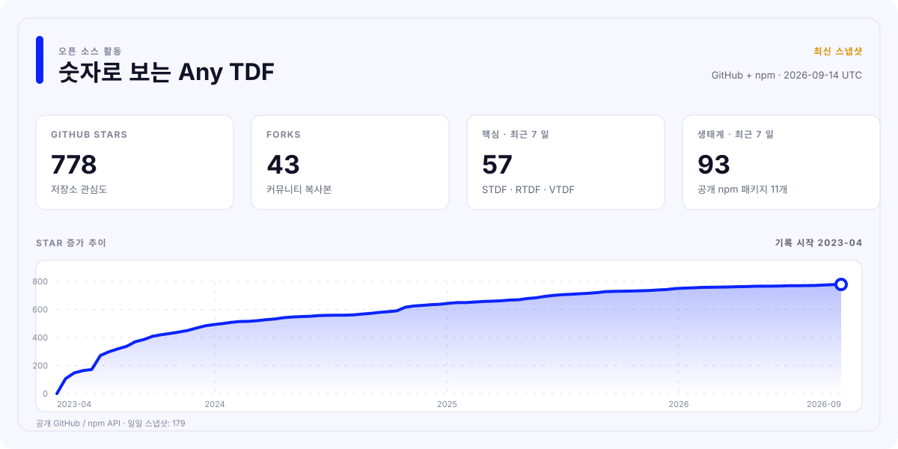

<div align="center">

[](https://github.com/any-tdf/any-tdf/actions/workflows/ci.yml)
[](https://github.com/any-tdf/any-tdf/actions/workflows/publish-npm.yml)
[](https://github.com/any-tdf/any-tdf/actions/workflows/publish-vscode.yml)
[](https://github.com/any-tdf/any-tdf/actions/workflows/release.yml)

<picture>
  <source media="(prefers-color-scheme: dark)" srcset="../.github/assets/any-tdf-logo-dark.svg" />
  <source media="(prefers-color-scheme: light)" srcset="../.github/assets/any-tdf-logo-light.svg" />
  
</picture>

# Any TDF

하나의 공유 디자인 시스템과 세 개의 프레임워크 네이티브 모바일 컴포넌트 라이브러리.

**Svelte용 STDF • React용 RTDF • Vue용 VTDF**


<p>
  <a href="https://www.npmjs.com/package/stdf"></a>
  <a href="https://www.npmjs.com/package/rtdf"></a>
  <a href="https://www.npmjs.com/package/vtdf"></a>
</p>

<p>
  <a href="https://www.npmjs.com/package/@any-tdf/common"></a>
  <a href="https://www.npmjs.com/package/create-any-tdf"></a>
  <a href="https://www.npmjs.com/package/@any-tdf/vite-plugin-svg-symbol"></a>
  <a href="https://www.npmjs.com/package/@any-tdf/vite-plugin-md-ts"></a>
</p>

<p>
  <a href="https://www.npmjs.com/package/@any-tdf/react-motion"></a>
  <a href="https://www.npmjs.com/package/@any-tdf/vue-motion"></a>
  <a href="https://www.npmjs.com/package/@any-tdf/react-confetti"></a>
  <a href="https://www.npmjs.com/package/@any-tdf/vue-confetti"></a>
</p>

[](../extensions/vscode-extension)
[](https://github.com/any-tdf/any-tdf)
[](https://github.com/any-tdf/any-tdf/blob/main/LICENSE)

[STDF](https://stdf.dev) • [RTDF](https://rtdf.dev) • [VTDF](https://vtdf.dev) • [Issues](https://github.com/any-tdf/any-tdf/issues) • [Discussions](https://github.com/any-tdf/any-tdf/discussions)

[English](../README.md) • [简体中文](./README_zh_CN.md) • [繁體中文](./README_zh_TW.md) • [日本語](./README_ja_JP.md) • [한국어](./README_ko_KR.md) • [Español](./README_es_ES.md) • [Русский](./README_ru_RU.md) • [Français](./README_fr_FR.md) • [Deutsch](./README_de_DE.md) • [Italiano](./README_it_IT.md)

</div>

## 소개

Any TDF는 Svelte, React, Vue를 위한 모바일 우선 컴포넌트 시스템입니다. 세 라이브러리는 제품 동작, 시각 언어, 테마, 로케일 데이터, 공개 타입, 문서 구조, 접근성 규칙을 공유하면서 각 프레임워크의 네이티브 렌더링 모델과 구성 방식을 유지합니다.

크로스 프레임워크 래퍼나 어댑터 뒤에 숨겨진 단일 런타임이 아닙니다. STDF는 Svelte 컴포넌트, Snippet, Action, Transition을 제공하고, RTDF는 React 컴포넌트, Props, 렌더 함수, Hook, Provider를 제공하며, VTDF는 Vue 컴포넌트, 슬롯, 이벤트, Composition API를 제공합니다.

## 제품군

| 라이브러리 | 네이티브 프레임워크 | npm 패키지                                   | 문서와 Demo                  |
| ---------- | ------------------- | -------------------------------------------- | ---------------------------- |
| STDF       | Svelte              | [`stdf`](https://www.npmjs.com/package/stdf) | [stdf.dev](https://stdf.dev) |
| RTDF       | React               | [`rtdf`](https://www.npmjs.com/package/rtdf) | [rtdf.dev](https://rtdf.dev) |
| VTDF       | Vue                 | [`vtdf`](https://www.npmjs.com/package/vtdf) | [vtdf.dev](https://vtdf.dev) |

## Any TDF를 선택하는 이유

- 프레임워크 네이티브 API와 예측 가능한 동작을 제공하는 60개의 정렬된 모바일 컴포넌트.
- 다크 모드, 런타임 전환, 사용자 정의 테마, 재사용 가능한 시맨틱 색상을 지원하는 공통 Tailwind CSS 테마 시스템.
- 60개 이상의 내장 로케일과 중국어 및 영어 가이드, API 레퍼런스, 컴포넌트 예제.
- TypeScript 우선 패키지 내보내기, SSR, 선택적 가져오기, 공통 접근성 동작.
- Svelte 네이티브 모션 의미 체계와 이에 맞춘 React 및 Vue 모션 패키지.
- 통합 프로젝트 생성기, SVG 스프라이트와 Markdown 플러그인, 오프라인 AI Skills, VS Code 확장.
- 세 구현을 일치시키는 계약, 패키지, 라우트, 브라우저, 시각적 검사.

## 빠른 시작

> 차세대 컴포넌트 제품군은 현재 npm의 `alpha` 태그로 배포됩니다. 두 Vite 플러그인은 안정적인 `latest` 태그를 사용합니다.

대화형으로 TypeScript 프로젝트를 생성합니다.

```sh
bun create any-tdf@alpha
```

프레임워크와 스타터를 직접 지정할 수도 있습니다.

```sh
bun create any-tdf@alpha my-app -f svelte -t sktt -b lucide
bun create any-tdf@alpha my-app -f react -t vrtt -b phosphor
bun create any-tdf@alpha my-app -f vue -t vrtt -b tabler
```

생성기는 Vite 및 SvelteKit 템플릿, TypeScript, Tailwind CSS 또는 UnoCSS, 여러 아이콘 방식, 내장 아이콘 라이브러리, 단일 또는 다중 테마 구성을 제공합니다. 모든 옵션은 [`create-any-tdf` 레퍼런스](../packages/create-any-tdf/README.md)에서 확인하세요.

기존 애플리케이션에 컴포넌트 라이브러리를 추가합니다.

```sh
bun add stdf@alpha svelte tailwindcss
bun add rtdf@alpha react react-dom tailwindcss
bun add vtdf@alpha vue tailwindcss
```

사용할 프레임워크의 한 줄만 설치하세요. 각 패키지는 공유 Any TDF 런타임 의존성을 자동으로 설치합니다. 스타일시트 가져오기, 테마 구성, 컴포넌트, 마이그레이션 가이드는 해당 공식 사이트를 참고하세요.

## 패키지 생태계

이 Monorepo에서 관리하는 모든 공개 npm 패키지는 다음과 같습니다. README 상단의 배지에서 각 패키지의 현재 공개 버전을 확인할 수 있습니다.

| 영역      | 패키지                                                                                             | 용도                                                           | 문서                                                   |
| --------- | -------------------------------------------------------------------------------------------------- | -------------------------------------------------------------- | ------------------------------------------------------ |
| 공유 기반 | [`@any-tdf/common`](https://www.npmjs.com/package/@any-tdf/common)                                 | 프레임워크 독립 상태, 테마, 로케일, SVG 데이터와 타입.         | [README](../packages/common/README.md)                 |
| 컴포넌트  | [`stdf`](https://www.npmjs.com/package/stdf)                                                       | Any TDF 컴포넌트 시스템의 Svelte 구현.                         | [stdf.dev](https://stdf.dev)                           |
| 컴포넌트  | [`rtdf`](https://www.npmjs.com/package/rtdf)                                                       | Any TDF 컴포넌트 시스템의 React 구현.                          | [rtdf.dev](https://rtdf.dev)                           |
| 컴포넌트  | [`vtdf`](https://www.npmjs.com/package/vtdf)                                                       | Any TDF 컴포넌트 시스템의 Vue 구현.                            | [vtdf.dev](https://vtdf.dev)                           |
| 스캐폴딩  | [`create-any-tdf`](https://www.npmjs.com/package/create-any-tdf)                                   | 프레임워크 네이티브 TypeScript 템플릿과 설정 옵션.             | [README](../packages/create-any-tdf/README.md)         |
| 빌드 도구 | [`@any-tdf/vite-plugin-svg-symbol`](https://www.npmjs.com/package/@any-tdf/vite-plugin-svg-symbol) | Vite와 Rollup에서 SVG 폴더를 재사용 가능한 Symbol로 결합.      | [README](../packages/vite-plugin-svg-symbol/README.md) |
| 빌드 도구 | [`@any-tdf/vite-plugin-md-ts`](https://www.npmjs.com/package/@any-tdf/vite-plugin-md-ts)           | Vite와 Rollup에서 Markdown을 원문 또는 생성된 HTML로 가져오기. | [README](../packages/vite-plugin-md-ts/README.md)      |
| 모션      | [`@any-tdf/react-motion`](https://www.npmjs.com/package/@any-tdf/react-motion)                     | React용 Svelte 호환 이징, 전환, 애니메이션과 Motion API.       | [Demo](https://react-motion.any-tdf.dev)               |
| 모션      | [`@any-tdf/vue-motion`](https://www.npmjs.com/package/@any-tdf/vue-motion)                         | Vue용 Svelte 호환 이징, 전환, 애니메이션과 Motion API.         | [Demo](https://vue-motion.any-tdf.dev)                 |
| Confetti  | [`@any-tdf/react-confetti`](https://www.npmjs.com/package/@any-tdf/react-confetti)                 | SSR 친화적인 React 순수 HTML 및 CSS Confetti 효과.             | [Demo](https://react-confetti.any-tdf.dev)             |
| Confetti  | [`@any-tdf/vue-confetti`](https://www.npmjs.com/package/@any-tdf/vue-confetti)                     | SSR 친화적인 Vue 순수 HTML 및 CSS Confetti 효과.               | [Demo](https://vue-confetti.any-tdf.dev)               |

## 공유 아키텍처와 네이티브 렌더링

공유 계층의 책임은 의도적으로 좁게 유지됩니다. `@any-tdf/common`은 재사용 가능한 상태 파생, 테마, 로케일 데이터, SVG 데이터, 타입, 소규모 플랫폼 유틸리티를 담당합니다. STDF, RTDF, VTDF는 이러한 계약을 사용하면서 각 프레임워크의 프리미티브로 렌더링합니다.

이 분리는 다음과 같은 이점을 제공합니다.

- 각 프레임워크에 익숙한 컴포넌트 문법, 이벤트, 슬롯, Children, 구성 방식.
- 일관된 컴포넌트 기능, 이름, 테마, 로케일 동작, 모바일 상호작용.
- 독립적인 npm 패키지, 문서 사이트, Demo, 릴리스 노트, 프레임워크 업데이트.
- 애플리케이션 코드에 크로스 프레임워크 렌더러나 추가 호환 런타임이 필요하지 않습니다.

## VS Code 확장

[Any TDF for VS Code](../extensions/vscode-extension/README.md)는 STDF, RTDF, VTDF 컴포넌트의 호버 문서와 API 자동 완성을 제공합니다. 가장 가까운 `package.json`을 감지하고 일치하는 라이브러리만 활성화합니다. Svelte, JSX, TSX, Vue 파일과 중국어 또는 영어 API 문서를 지원합니다.

확장 소스와 패키징 및 배포 검사는 이 Monorepo에서 관리됩니다. 로컬 VSIX를 빌드하려면 다음을 실행하세요.

```sh
bun run --filter stdf-vscode-extension package
```

## 오프라인 AI Skills

프레임워크별 Skills는 AI 코딩 에이전트를 위한 컴포넌트 레퍼런스, 테마, 국제화 가이드, 스캐폴딩 안내, 아이콘 방식, 테마 생성 스크립트를 제공합니다. 소스 저장소에서 관리되며 의도적으로 npm에 배포하지 않습니다.

- [`stdf-skill`](../packages/skills/stdf-skill/README.md)
- [`rtdf-skill`](../packages/skills/rtdf-skill/README.md)
- [`vtdf-skill`](../packages/skills/vtdf-skill/README.md)

## Monorepo 개발

저장소는 Bun Workspaces, Turborepo, Changesets, 단일 루트 잠금 파일을 사용합니다. 개발에는 Bun과 Node.js를 사용하며 의존성은 저장소 루트에서만 설치합니다.

```sh
bun install --frozen-lockfile
bun run check
bun run test
bun run build
bun run verify
```

Any TDF 포털 또는 프레임워크별 사이트와 Demo를 함께 실행합니다.

```sh
bun run dev:any-tdf
bun run dev:stdf
bun run dev:rtdf
bun run dev:vtdf
```

저장소 전체에서 자주 사용하는 명령:

| 명령                     | 용도                                                   |
| ------------------------ | ------------------------------------------------------ |
| `bun run generate`       | 프레임워크, 문서, 버전, 확장 데이터를 다시 생성합니다. |
| `bun run generate:check` | 생성된 파일이 원본과 일치하는지 확인합니다.            |
| `bun run quality:check`  | Monorepo를 빌드하고 포맷과 lint를 검사합니다.          |
| `bun run verify:browser` | 실제 브라우저에서 Demo와 문서 상호작용을 검증합니다.   |
| `bun run changeset`      | 다음 릴리스에 포함될 패키지 변경을 기록합니다.         |

## 저장소 구조

- `apps`: 문서 사이트, 컴포넌트 Demo, 공통 사이트 코드.
- `packages`: 공통 코어, 프레임워크 라이브러리, Vite 플러그인, Motion 및 Confetti 런타임과 패키지 문서, AI Skills, `create-any-tdf`.
- `content`: 생성된 STDF, RTDF, VTDF 컴포넌트와 가이드.
- `extensions`: Any TDF VS Code 확장.
- `scripts`: 저장소 전체 생성, 검증, 패키징, 릴리스 도구.

## 기여 및 피드백

재현 가능한 버그와 기능 요청은 [GitHub Issues](https://github.com/any-tdf/any-tdf/issues), 질문, 제안, 구현 아이디어는 [GitHub Discussions](https://github.com/any-tdf/any-tdf/discussions)를 이용하세요. 컴포넌트, 문서, 도구, 테스트, 예제, 번역 기여를 환영합니다.

전체 목록은 [기여자 그래프](https://github.com/any-tdf/any-tdf/graphs/contributors)에서 확인할 수 있습니다.

## 후원자

프로젝트를 지원하는 [sbscan](https://github.com/sbscan), [MuGuiLin](https://github.com/MuGuiLin), [yuedanlabs](https://github.com/yuedanlabs)에 감사드립니다.

## 라이선스

Any TDF는 [MIT License](https://github.com/any-tdf/any-tdf/blob/main/LICENSE)로 배포됩니다.

## 프로젝트 통계

<a href="https://any-tdf.dev/#statistics">
  <picture>
    <source media="(prefers-color-scheme: dark)" srcset="../.github/assets/project-stats-ko_KR-dark.svg" />
    
  </picture>
</a>

데이터는 공개 GitHub 및 npm API를 통해 매주 갱신되며, 추이 기록은 Any TDF의 첫 번째 스냅샷부터 누적됩니다.
