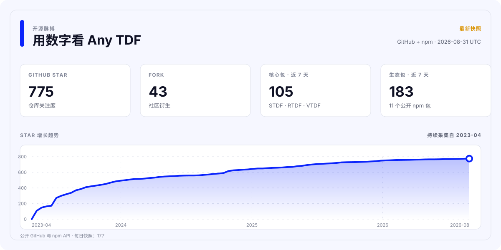

<div align="center">

[](https://github.com/any-tdf/any-tdf/actions/workflows/ci.yml)
[](https://github.com/any-tdf/any-tdf/actions/workflows/publish-npm.yml)
[](https://github.com/any-tdf/any-tdf/actions/workflows/publish-vscode.yml)
[](https://github.com/any-tdf/any-tdf/actions/workflows/release.yml)

<picture>
  <source media="(prefers-color-scheme: dark)" srcset="../.github/assets/any-tdf-logo-dark.svg" />
  <source media="(prefers-color-scheme: light)" srcset="../.github/assets/any-tdf-logo-light.svg" />
  
</picture>

# Any TDF

一套共享设计系统，三套框架原生移动端组件库。

**面向 Svelte 的 STDF • 面向 React 的 RTDF • 面向 Vue 的 VTDF**


<p>
  <a href="https://www.npmjs.com/package/stdf"></a>
  <a href="https://www.npmjs.com/package/rtdf"></a>
  <a href="https://www.npmjs.com/package/vtdf"></a>
</p>

<p>
  <a href="https://www.npmjs.com/package/@any-tdf/common"></a>
  <a href="https://www.npmjs.com/package/create-any-tdf"></a>
  <a href="https://www.npmjs.com/package/@any-tdf/vite-plugin-svg-symbol"></a>
  <a href="https://www.npmjs.com/package/@any-tdf/vite-plugin-md-ts"></a>
</p>

<p>
  <a href="https://www.npmjs.com/package/@any-tdf/react-motion"></a>
  <a href="https://www.npmjs.com/package/@any-tdf/vue-motion"></a>
  <a href="https://www.npmjs.com/package/@any-tdf/react-confetti"></a>
  <a href="https://www.npmjs.com/package/@any-tdf/vue-confetti"></a>
</p>

[](../extensions/vscode-extension)
[](https://github.com/any-tdf/any-tdf)
[](https://github.com/any-tdf/any-tdf/blob/main/LICENSE)

[STDF](https://stdf.dev) • [RTDF](https://rtdf.dev) • [VTDF](https://vtdf.dev)

[English](../README.md) • [简体中文](./README_zh_CN.md) • [繁體中文](./README_zh_TW.md) • [日本語](./README_ja_JP.md) • [한국어](./README_ko_KR.md) • [Español](./README_es_ES.md) • [Русский](./README_ru_RU.md) • [Français](./README_fr_FR.md) • [Deutsch](./README_de_DE.md) • [Italiano](./README_it_IT.md)

</div>

## 项目介绍

Any TDF 是面向 Svelte、React 和 Vue 的移动优先组件系统。三套组件库共享产品行为、视觉语言、主题、多语言数据、公共类型、文档结构和无障碍规则，同时保留各框架原生的渲染模型与组合方式。

它不是跨框架包装层，也不是隐藏在适配器背后的单一运行时。STDF 提供 Svelte 组件、Snippet、Action 和 Transition；RTDF 提供 React 组件、Props、渲染函数、Hook 和 Provider；VTDF 提供 Vue 组件、插槽、事件和组合式函数。

## 产品家族

| 组件库 | 原生框架 | npm 包                                       | 文档与 Demo                  |
| ------ | -------- | -------------------------------------------- | ---------------------------- |
| STDF   | Svelte   | [`stdf`](https://www.npmjs.com/package/stdf) | [stdf.dev](https://stdf.dev) |
| RTDF   | React    | [`rtdf`](https://www.npmjs.com/package/rtdf) | [rtdf.dev](https://rtdf.dev) |
| VTDF   | Vue      | [`vtdf`](https://www.npmjs.com/package/vtdf) | [vtdf.dev](https://vtdf.dev) |

## 为什么选择 Any TDF

- 60 个能力对齐的移动端组件，提供符合各框架习惯的原生 API 和可预期行为。
- 共享的 Tailwind CSS 主题系统，支持暗色模式、运行时切换、自定义主题和可复用的语义色。
- 内置 60 多种语言包，并提供中英文指南、API 参考和组件示例。
- TypeScript 优先的软件包导出，支持 SSR、按需引入和共享的无障碍行为。
- 使用原生 Svelte 动效语义，并提供与之对齐的 React 和 Vue 动效软件包。
- 提供统一项目生成器、SVG Sprite 与 Markdown 插件、离线 AI Skills 和 VS Code 扩展。
- 通过契约、软件包、路由、浏览器和视觉检查保持三套实现一致。

## 快速开始

> 新一代组件家族目前通过 npm 的 `alpha` 标签发布，两个 Vite 插件使用稳定的 `latest` 标签。

交互式创建 TypeScript 项目：

```sh
bun create any-tdf@alpha
```

也可以直接指定框架和模板：

```sh
bun create any-tdf@alpha my-app -f svelte -t sktt -b lucide
bun create any-tdf@alpha my-app -f react -t vrtt -b phosphor
bun create any-tdf@alpha my-app -f vue -t vrtt -b tabler
```

项目生成器提供 Vite 与 SvelteKit 模板、TypeScript、Tailwind CSS 或 UnoCSS、多种图标方案、内置图标库以及单主题或多主题配置。全部选项请查看 [`create-any-tdf` 参考文档](../packages/create-any-tdf/README.md)。

向现有应用添加组件库：

```sh
bun add stdf@alpha svelte tailwindcss
bun add rtdf@alpha react react-dom tailwindcss
bun add vtdf@alpha vue tailwindcss
```

只需安装与你的框架对应的一行。每个组件库都会自动安装其 Any TDF 共享运行时依赖。样式表导入、主题配置、组件和迁移指南请继续查看对应官网。

## 软件包生态

本 Monorepo 维护的所有公开 npm 软件包如下。README 顶部的徽标会显示每个软件包的实时版本。

| 领域     | 软件包                                                                                             | 用途                                                            | 文档                                                   |
| -------- | -------------------------------------------------------------------------------------------------- | --------------------------------------------------------------- | ------------------------------------------------------ |
| 共享基础 | [`@any-tdf/common`](https://www.npmjs.com/package/@any-tdf/common)                                 | 与框架无关的组件状态、主题、多语言、SVG 数据和类型。            | [README](../packages/common/README.md)                 |
| 组件库   | [`stdf`](https://www.npmjs.com/package/stdf)                                                       | Any TDF 组件系统的 Svelte 实现。                                | [stdf.dev](https://stdf.dev)                           |
| 组件库   | [`rtdf`](https://www.npmjs.com/package/rtdf)                                                       | Any TDF 组件系统的 React 实现。                                 | [rtdf.dev](https://rtdf.dev)                           |
| 组件库   | [`vtdf`](https://www.npmjs.com/package/vtdf)                                                       | Any TDF 组件系统的 Vue 实现。                                   | [vtdf.dev](https://vtdf.dev)                           |
| 脚手架   | [`create-any-tdf`](https://www.npmjs.com/package/create-any-tdf)                                   | 提供框架原生的 TypeScript 项目模板和配置选项。                  | [README](../packages/create-any-tdf/README.md)         |
| 构建工具 | [`@any-tdf/vite-plugin-svg-symbol`](https://www.npmjs.com/package/@any-tdf/vite-plugin-svg-symbol) | 在 Vite 和 Rollup 中将 SVG 文件夹合并为可复用的 Symbol Sprite。 | [README](../packages/vite-plugin-svg-symbol/README.md) |
| 构建工具 | [`@any-tdf/vite-plugin-md-ts`](https://www.npmjs.com/package/@any-tdf/vite-plugin-md-ts)           | 在 Vite 和 Rollup 中将 Markdown 导入为源文本或生成后的 HTML。   | [README](../packages/vite-plugin-md-ts/README.md)      |
| 动效     | [`@any-tdf/react-motion`](https://www.npmjs.com/package/@any-tdf/react-motion)                     | 面向 React、与 Svelte 对齐的缓动、过渡、动画和 Motion API。     | [Demo](https://react-motion.any-tdf.dev)               |
| 动效     | [`@any-tdf/vue-motion`](https://www.npmjs.com/package/@any-tdf/vue-motion)                         | 面向 Vue、与 Svelte 对齐的缓动、过渡、动画和 Motion API。       | [Demo](https://vue-motion.any-tdf.dev)                 |
| 彩纸特效 | [`@any-tdf/react-confetti`](https://www.npmjs.com/package/@any-tdf/react-confetti)                 | 兼容 SSR 的 React 纯 HTML 与 CSS 彩纸特效实现。                 | [Demo](https://react-confetti.any-tdf.dev)             |
| 彩纸特效 | [`@any-tdf/vue-confetti`](https://www.npmjs.com/package/@any-tdf/vue-confetti)                     | 兼容 SSR 的 Vue 纯 HTML 与 CSS 彩纸特效实现。                   | [Demo](https://vue-confetti.any-tdf.dev)               |

## 共享架构，原生渲染

共享层的职责被有意控制在清晰范围内。`@any-tdf/common` 负责可复用的状态推导、主题、多语言数据、SVG 数据、类型和少量平台工具。STDF、RTDF 与 VTDF 使用这些共享契约，但通过各自框架的原生能力完成渲染。

这种分层为使用者带来：

- 符合各框架习惯的组件语法、事件、插槽、Children 和组合方式。
- 一致的组件能力、命名、主题、多语言行为和移动端交互。
- 独立的 npm 软件包、文档官网、Demo、发布说明和框架升级节奏。
- 应用代码中不需要跨框架渲染器或额外兼容运行时。

## VS Code 扩展

[Any TDF for VS Code](../extensions/vscode-extension/README_CN.md) 为 STDF、RTDF 和 VTDF 提供悬停文档与组件 API 补全。它会检测最近的 `package.json`，只激活对应组件库，支持 Svelte、JSX、TSX 与 Vue 文件，并可显示中文或英文 API 文档。

扩展源码与其打包和发布检查均在本 Monorepo 中维护。构建本地 VSIX：

```sh
bun run --filter stdf-vscode-extension package
```

## 离线 AI Skills

各框架专用 Skill 为 AI 编程代理整理了组件参考、主题、国际化指南、脚手架说明、图标方案和主题生成脚本。它们随源码仓库维护，并且有意不发布到 npm。

- [`stdf-skill`](../packages/skills/stdf-skill/README.md)
- [`rtdf-skill`](../packages/skills/rtdf-skill/README.md)
- [`vtdf-skill`](../packages/skills/vtdf-skill/README.md)

## Monorepo 开发

仓库使用 Bun Workspaces、Turborepo、Changesets 和唯一根锁文件。开发使用 Bun 与 Node.js，依赖只能从仓库根目录安装。

```sh
bun install --frozen-lockfile
bun run check
bun run test
bun run build
bun run verify
```

启动 Any TDF 综合站，或同时启动某一框架的官网和 Demo：

```sh
bun run dev:any-tdf
bun run dev:stdf
bun run dev:rtdf
bun run dev:vtdf
```

常用的全仓命令：

| 命令                     | 用途                                  |
| ------------------------ | ------------------------------------- |
| `bun run generate`       | 重新生成框架、文档、版本与扩展数据。  |
| `bun run generate:check` | 确认生成文件与其来源一致。            |
| `bun run quality:check`  | 构建 Monorepo，并检查格式与代码规范。 |
| `bun run verify:browser` | 在真实浏览器中验证 Demo 与文档交互。  |
| `bun run changeset`      | 描述下一次发布包含的软件包变更。      |

## 仓库结构

- `apps`：文档官网、组件 Demo 和站点共享代码。
- `packages`：共享核心、框架组件库、Vite 插件、Motion 与 Confetti 运行时及其包内文档、AI Skills 和 `create-any-tdf`。
- `content`：生成后的 STDF、RTDF 和 VTDF 组件与指南内容。
- `extensions`：Any TDF VS Code 扩展。
- `scripts`：全仓生成、验证、打包和发布工具。

## 贡献与反馈

请使用 [GitHub Issues](https://github.com/any-tdf/any-tdf/issues) 提交可复现的缺陷和功能建议，使用 [GitHub Discussions](https://github.com/any-tdf/any-tdf/discussions) 交流问题、提案和实现思路。欢迎参与组件、文档、工具、测试、示例和翻译。

完整名单请查看[贡献者图谱](https://github.com/any-tdf/any-tdf/graphs/contributors)。

## 赞助者

感谢 [sbscan](https://github.com/sbscan)、[MuGuiLin](https://github.com/MuGuiLin) 和 [yuedanlabs](https://github.com/yuedanlabs) 对项目的支持。

## 开源协议

Any TDF 基于 [MIT License](https://github.com/any-tdf/any-tdf/blob/main/LICENSE) 开源。

## 项目统计

<a href="https://any-tdf.dev/#statistics">
  <picture>
    <source media="(prefers-color-scheme: dark)" srcset="../.github/assets/project-stats-zh_CN-dark.svg" />
    
  </picture>
</a>

数据每周通过公开的 GitHub 和 npm API 更新，趋势从 Any TDF 的首个快照开始累计。
