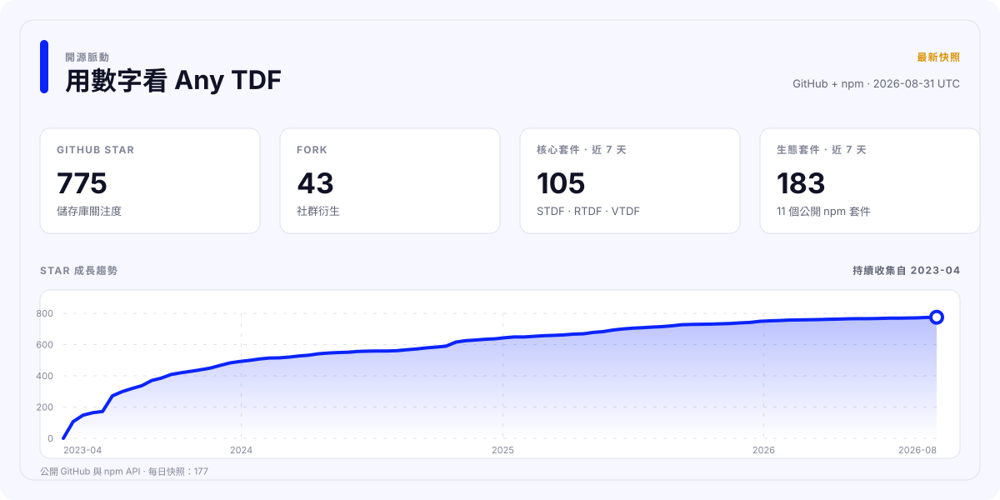

<div align="center">

[](https://github.com/any-tdf/any-tdf/actions/workflows/ci.yml)
[](https://github.com/any-tdf/any-tdf/actions/workflows/publish-npm.yml)
[](https://github.com/any-tdf/any-tdf/actions/workflows/publish-vscode.yml)
[](https://github.com/any-tdf/any-tdf/actions/workflows/release.yml)

<picture>
  <source media="(prefers-color-scheme: dark)" srcset="../.github/assets/any-tdf-logo-dark.svg" />
  <source media="(prefers-color-scheme: light)" srcset="../.github/assets/any-tdf-logo-light.svg" />
  
</picture>

# Any TDF

一套共享設計系統，三套框架原生行動端元件庫。

**面向 Svelte 的 STDF • 面向 React 的 RTDF • 面向 Vue 的 VTDF**


<p>
  <a href="https://www.npmjs.com/package/stdf"></a>
  <a href="https://www.npmjs.com/package/rtdf"></a>
  <a href="https://www.npmjs.com/package/vtdf"></a>
</p>

<p>
  <a href="https://www.npmjs.com/package/@any-tdf/common"></a>
  <a href="https://www.npmjs.com/package/create-any-tdf"></a>
  <a href="https://www.npmjs.com/package/@any-tdf/vite-plugin-svg-symbol"></a>
  <a href="https://www.npmjs.com/package/@any-tdf/vite-plugin-md-ts"></a>
</p>

<p>
  <a href="https://www.npmjs.com/package/@any-tdf/react-motion"></a>
  <a href="https://www.npmjs.com/package/@any-tdf/vue-motion"></a>
  <a href="https://www.npmjs.com/package/@any-tdf/react-confetti"></a>
  <a href="https://www.npmjs.com/package/@any-tdf/vue-confetti"></a>
</p>

[](../extensions/vscode-extension)
[](https://github.com/any-tdf/any-tdf)
[](https://github.com/any-tdf/any-tdf/blob/main/LICENSE)

[STDF](https://stdf.dev) • [RTDF](https://rtdf.dev) • [VTDF](https://vtdf.dev) • [Issues](https://github.com/any-tdf/any-tdf/issues) • [Discussions](https://github.com/any-tdf/any-tdf/discussions)

[English](../README.md) • [简体中文](./README_zh_CN.md) • [繁體中文](./README_zh_TW.md) • [日本語](./README_ja_JP.md) • [한국어](./README_ko_KR.md) • [Español](./README_es_ES.md) • [Русский](./README_ru_RU.md) • [Français](./README_fr_FR.md) • [Deutsch](./README_de_DE.md) • [Italiano](./README_it_IT.md)

</div>

## 專案介紹

Any TDF 是面向 Svelte、React 和 Vue 的行動優先元件系統。三套元件庫共享產品行為、視覺語言、主題、多語言資料、公共類型、文件結構和無障礙規則，同時保留各框架原生的渲染模型與組合方式。

它不是跨框架包裝層，也不是隱藏在轉接器背後的單一執行環境。STDF 提供 Svelte 元件、Snippet、Action 和 Transition；RTDF 提供 React 元件、Props、渲染函式、Hook 和 Provider；VTDF 提供 Vue 元件、插槽、事件和組合式函式。

## 產品家族

| 元件庫 | 原生框架 | npm 套件                                     | 文件與 Demo                  |
| ------ | -------- | -------------------------------------------- | ---------------------------- |
| STDF   | Svelte   | [`stdf`](https://www.npmjs.com/package/stdf) | [stdf.dev](https://stdf.dev) |
| RTDF   | React    | [`rtdf`](https://www.npmjs.com/package/rtdf) | [rtdf.dev](https://rtdf.dev) |
| VTDF   | Vue      | [`vtdf`](https://www.npmjs.com/package/vtdf) | [vtdf.dev](https://vtdf.dev) |

## 為什麼選擇 Any TDF

- 60 個能力對齊的行動端元件，提供符合各框架習慣的原生 API 和可預期行為。
- 共享的 Tailwind CSS 主題系統，支援深色模式、執行時切換、自訂主題和可重用的語意色。
- 內建 60 多種語言套件，並提供中英文指南、API 參考和元件範例。
- TypeScript 優先的套件匯出，支援 SSR、按需匯入和共享的無障礙行為。
- 使用原生 Svelte 動效語意，並提供與之對齊的 React 和 Vue 動效套件。
- 提供統一專案產生器、SVG Sprite 與 Markdown 外掛、離線 AI Skills 和 VS Code 擴充功能。
- 透過契約、套件、路由、瀏覽器和視覺檢查保持三套實作一致。

## 快速開始

> 新一代元件家族目前透過 npm 的 `alpha` 標籤發布，兩個 Vite 外掛使用穩定的 `latest` 標籤。

互動式建立 TypeScript 專案：

```sh
bun create any-tdf@alpha
```

也可以直接指定框架和模板：

```sh
bun create any-tdf@alpha my-app -f svelte -t sktt -b lucide
bun create any-tdf@alpha my-app -f react -t vrtt -b phosphor
bun create any-tdf@alpha my-app -f vue -t vrtt -b tabler
```

專案產生器提供 Vite 與 SvelteKit 模板、TypeScript、Tailwind CSS 或 UnoCSS、多種圖示方案、內建圖示庫以及單主題或多主題設定。全部選項請查看 [`create-any-tdf` 參考文件](../packages/create-any-tdf/README.md)。

向現有應用程式加入元件庫：

```sh
bun add stdf@alpha svelte tailwindcss
bun add rtdf@alpha react react-dom tailwindcss
bun add vtdf@alpha vue tailwindcss
```

只需安裝與你的框架對應的一行。每個元件庫都會自動安裝其 Any TDF 共享執行環境相依套件。樣式表匯入、主題設定、元件和遷移指南請繼續查看對應官網。

## 套件生態

本 Monorepo 維護的所有公開 npm 套件如下。README 頂部的徽標會顯示每個套件的即時版本。

| 領域     | 套件                                                                                               | 用途                                                            | 文件                                                   |
| -------- | -------------------------------------------------------------------------------------------------- | --------------------------------------------------------------- | ------------------------------------------------------ |
| 共享基礎 | [`@any-tdf/common`](https://www.npmjs.com/package/@any-tdf/common)                                 | 與框架無關的元件狀態、主題、多語言、SVG 資料和類型。            | [README](../packages/common/README.md)                 |
| 元件庫   | [`stdf`](https://www.npmjs.com/package/stdf)                                                       | Any TDF 元件系統的 Svelte 實作。                                | [stdf.dev](https://stdf.dev)                           |
| 元件庫   | [`rtdf`](https://www.npmjs.com/package/rtdf)                                                       | Any TDF 元件系統的 React 實作。                                 | [rtdf.dev](https://rtdf.dev)                           |
| 元件庫   | [`vtdf`](https://www.npmjs.com/package/vtdf)                                                       | Any TDF 元件系統的 Vue 實作。                                   | [vtdf.dev](https://vtdf.dev)                           |
| 鷹架     | [`create-any-tdf`](https://www.npmjs.com/package/create-any-tdf)                                   | 提供框架原生的 TypeScript 專案模板和設定選項。                  | [README](../packages/create-any-tdf/README.md)         |
| 建置工具 | [`@any-tdf/vite-plugin-svg-symbol`](https://www.npmjs.com/package/@any-tdf/vite-plugin-svg-symbol) | 在 Vite 和 Rollup 中將 SVG 資料夾合併為可重用的 Symbol Sprite。 | [README](../packages/vite-plugin-svg-symbol/README.md) |
| 建置工具 | [`@any-tdf/vite-plugin-md-ts`](https://www.npmjs.com/package/@any-tdf/vite-plugin-md-ts)           | 在 Vite 和 Rollup 中將 Markdown 匯入為來源文字或產生後的 HTML。 | [README](../packages/vite-plugin-md-ts/README.md)      |
| 動效     | [`@any-tdf/react-motion`](https://www.npmjs.com/package/@any-tdf/react-motion)                     | 面向 React、與 Svelte 對齊的緩動、過渡、動畫和 Motion API。     | [Demo](https://react-motion.any-tdf.dev)               |
| 動效     | [`@any-tdf/vue-motion`](https://www.npmjs.com/package/@any-tdf/vue-motion)                         | 面向 Vue、與 Svelte 對齊的緩動、過渡、動畫和 Motion API。       | [Demo](https://vue-motion.any-tdf.dev)                 |
| 彩紙特效 | [`@any-tdf/react-confetti`](https://www.npmjs.com/package/@any-tdf/react-confetti)                 | 相容 SSR 的 React 純 HTML 與 CSS 彩紙特效實作。                 | [Demo](https://react-confetti.any-tdf.dev)             |
| 彩紙特效 | [`@any-tdf/vue-confetti`](https://www.npmjs.com/package/@any-tdf/vue-confetti)                     | 相容 SSR 的 Vue 純 HTML 與 CSS 彩紙特效實作。                   | [Demo](https://vue-confetti.any-tdf.dev)               |

## 共享架構，原生渲染

共享層的職責被刻意控制在清晰範圍內。`@any-tdf/common` 負責可重用的狀態推導、主題、多語言資料、SVG 資料、類型和少量平台工具。STDF、RTDF 與 VTDF 使用這些共享契約，但透過各自框架的原生能力完成渲染。

這種分層為使用者帶來：

- 符合各框架習慣的元件語法、事件、插槽、Children 和組合方式。
- 一致的元件能力、命名、主題、多語言行為和行動端互動。
- 獨立的 npm 套件、文件官網、Demo、發布說明和框架升級節奏。
- 應用程式碼中不需要跨框架渲染器或額外相容執行環境。

## VS Code 擴充功能

[Any TDF for VS Code](../extensions/vscode-extension/README_CN.md) 為 STDF、RTDF 和 VTDF 提供懸停文件與元件 API 補全。它會偵測最近的 `package.json`，只啟用對應元件庫，支援 Svelte、JSX、TSX 與 Vue 檔案，並可顯示中文或英文 API 文件。

擴充功能原始碼與其打包和發布檢查均在本 Monorepo 中維護。建置本機 VSIX：

```sh
bun run --filter stdf-vscode-extension package
```

## 離線 AI Skills

各框架專用 Skill 為 AI 程式設計代理整理了元件參考、主題、國際化指南、鷹架說明、圖示方案和主題產生腳本。它們隨原始碼倉庫維護，並且刻意不發布到 npm。

- [`stdf-skill`](../packages/skills/stdf-skill/README.md)
- [`rtdf-skill`](../packages/skills/rtdf-skill/README.md)
- [`vtdf-skill`](../packages/skills/vtdf-skill/README.md)

## Monorepo 開發

倉庫使用 Bun Workspaces、Turborepo、Changesets 和唯一根鎖定檔。開發使用 Bun 與 Node.js，相依套件只能從倉庫根目錄安裝。

```sh
bun install --frozen-lockfile
bun run check
bun run test
bun run build
bun run verify
```

啟動 Any TDF 綜合站，或同時啟動某一框架的官網和 Demo：

```sh
bun run dev:any-tdf
bun run dev:stdf
bun run dev:rtdf
bun run dev:vtdf
```

常用的全倉命令：

| 命令                     | 用途                                     |
| ------------------------ | ---------------------------------------- |
| `bun run generate`       | 重新產生框架、文件、版本與擴充功能資料。 |
| `bun run generate:check` | 確認產生檔案與其來源一致。               |
| `bun run quality:check`  | 建置 Monorepo，並檢查格式與程式碼規範。  |
| `bun run verify:browser` | 在真實瀏覽器中驗證 Demo 與文件互動。     |
| `bun run changeset`      | 描述下一次發布包含的套件變更。           |

## 倉庫結構

- `apps`：文件官網、元件 Demo 和站點共享程式碼。
- `packages`：共享核心、框架元件庫、Vite 外掛、Motion 與 Confetti 執行環境及其套件內文件、AI Skills 和 `create-any-tdf`。
- `content`：產生後的 STDF、RTDF 和 VTDF 元件與指南內容。
- `extensions`：Any TDF VS Code 擴充功能。
- `scripts`：全倉產生、驗證、打包和發布工具。

## 貢獻與回饋

請使用 [GitHub Issues](https://github.com/any-tdf/any-tdf/issues) 提交可重現的缺陷和功能建議，使用 [GitHub Discussions](https://github.com/any-tdf/any-tdf/discussions) 交流問題、提案和實作思路。歡迎參與元件、文件、工具、測試、範例和翻譯。

完整名單請查看 [貢獻者圖譜](https://github.com/any-tdf/any-tdf/graphs/contributors)。

## 贊助者

感謝 [sbscan](https://github.com/sbscan)、[MuGuiLin](https://github.com/MuGuiLin) 和 [yuedanlabs](https://github.com/yuedanlabs) 對專案的支持。

## 開源協議

Any TDF 基於 [MIT License](https://github.com/any-tdf/any-tdf/blob/main/LICENSE) 開源。

## 專案統計

<a href="https://any-tdf.dev/#statistics">
  <picture>
    <source media="(prefers-color-scheme: dark)" srcset="../.github/assets/project-stats-zh_TW-dark.svg" />
    
  </picture>
</a>

資料每日透過公開的 GitHub 和 npm API 更新，趨勢從 Any TDF 的首個快照開始累積。
